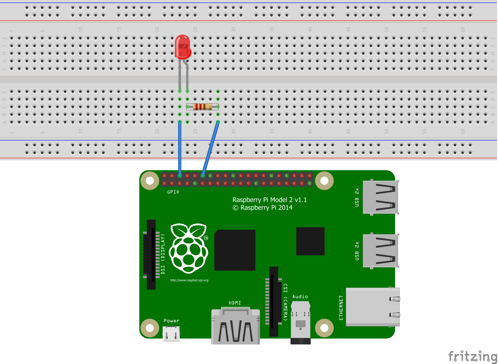

# LenyugozoCsharp
A NetAcademia lenyűgöző C# tanfolyam kiegészítő kódtára

- több alkalomra szétszedtük a tanfolyamot
  - Rasberry PI használata C# nyelven, led villogtatás (ma)
  - Saját csevegőrobot készítése saját gépen (botframework-simulator használatával)
  - csevegőrobot felhőbe telepítése (Azure) és összekötjük a Skype és a Facebook Messenger platformokkal.
  

# Telepítések

- Visual Studio Code + Git telepítése ([innen](https://code.visualstudio.com/))
  alapértelmezett beálításokkal, egyedül a szerkesztőnél kell beállítani a VIM helyett például a VisualStudioCode-ot.

- fritzig: rajzolóprogram ([innen tudjuk letölteni](http://fritzing.org/download/))
  Válasszuk a **No Donation**-t az ingyenes letöltéshez. Letöltés után a .zip archívumot tömörítsük ki valahová, ott tudjuk majd elindítani.

- DotNet környezet telepítése [innen](https://www.microsoft.com/net/download/windows)
  Letöltjük és futtatjuk a telepítőt, alapértelmezett beállításokkal.
  
- Docker telepítése [innen](https://store.docker.com/editions/community/docker-ce-desktop-windows)
 letöltjük, telepítjük.
 **Fontos:**
  - csak adminisztrátor felhasználóként telepítsük, 
  - többször újraindíthatja a gépet. 
  - HyperV-t engedélyezteti első induláskor

- SSH kliens (Windows-hoz: a Putty-ot fogjuk használni, [innen letölthető](https://www.chiark.greenend.org.uk/~sgtatham/putty/latest.html))

- zenmap: ezzel keressük meg a Raspberry-nket a hálózatunkon [innen](https://sourceforge.net/projects/nmap.mirror/?source=typ_redirect).

- Visual Studio Extensions:
  C#, Docker
  (Baloldalon az alsó ikon, és a keresőmezőbe: C#/Docker, **Install** gomb majd **Reload** gomb)

# Tematika

## Raspberry PI

### Megtervezzük, hogy mit is csinálunk? 

A Fritzing használatával kapcsolási rajzot készítünk a megvalósításhoz. Akit az elektronikai kérdések érdekelnek, az [ezen az ingyenes tanfolyamon](https://app.netacademia.hu/Tanfolyam/ELAI-I-az-elektronika-alapismeretei-i) tud egy kicsit jobban elmélyülni.

- A Raspberry GPIO az a felület, ahol elektronikai eszközöket tudunk a számítógéphez csatlakoztatni.
- A GPIO a tápfeszültség csatlakozóval szemben lévő oldalon van, két sor tüske.
- A külső oldalán fogunk két tüskét tüskét használni.
- (Ha felénk áll a tápfeszültség csatlakozó, akkor) Balról a harmadik tüske a földpont.
- A hatodik pedig az áramkörünk másik végpontja: ezt tudjuk PIN01 névvel megszólítani.
- Egy ledet és egy 650 Ohm-os ellenállást kötünk sorba erre áramkörre.



Egy [ingyenes tanfolyam](https://app.netacademia.hu/Tanfolyam/rpifree-bevezetes-a-raspberry-pi-es-a-beagyazott-szoftverfejlesztes-kepzesbe) a Raspberry lelkivilágáról.

## Saját alkalmazás készítése

### Első működő verzió (csak válaszol)

```
md rpi.server
cd rpi.server
dotnet new webapi
```
### Csomagolás Docker segítségével
- A Dockerfile-ban leírjuk, hogy hogy épül fel a csomag
- build.bat-ban elkészítjük a "programot", ami előállítja és felküldi a docker hub-ra az egészet
- készítünk egy Docker Hub repo-t, ahova kerül a docker csomag, és ahonnan lehúzzuk a Raspberry-re ([ezaz](https://hub.docker.com/r/gplesz/rpi.server/)

# ajánlott tanfolyamok
- [Programozási alapismeretek C# nyelven](https://app.netacademia.hu/Tanfolyam/CsharpFree-programozasi-alapismeretek-c-nyelven)
- [ezen az ingyenes tanfolyamon](https://app.netacademia.hu/Tanfolyam/ELAI-I-az-elektronika-alapismeretei-i)
- Egy [ingyenes tanfolyam](https://app.netacademia.hu/Tanfolyam/rpifree-bevezetes-a-raspberry-pi-es-a-beagyazott-szoftverfejlesztes-kepzesbe) a Raspberry lelkivilágáról.
- [Hálózati alapismeretek](https://app.netacademia.hu/Tanfolyam/HA-halozati-alapismeretek)